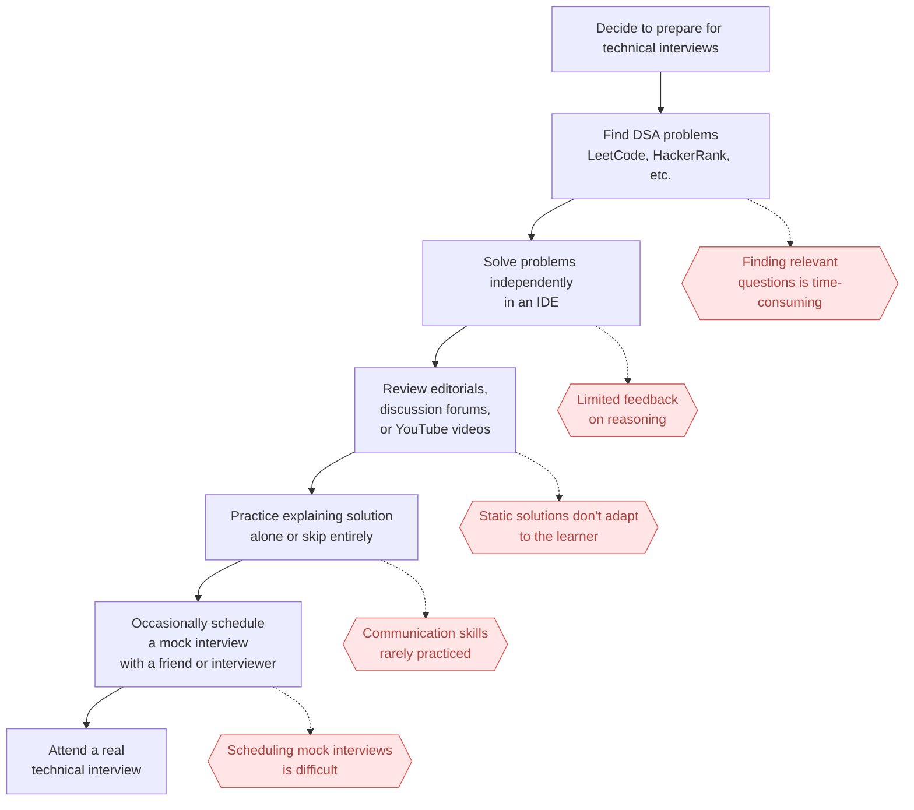
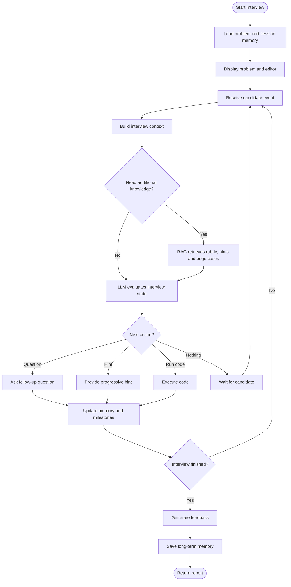

# swell-demo

A demo repo for swell, an AI software engineering coach that helps you practice data structures and algorithms through realistic technical interviews.

**Demo video**: https://youtu.be/3bcF3ELRArY

**Deliverables traceability**: see [`deliverables.md`](deliverables.md) for a mapping of every rubric deliverable to its exact code location.

## Task 1: Defining Problem, Audience, and Scope

Software engineers struggle to prepare effectively for technical interviews because practicing coding problems alone does not replicate the experience of a real interview.

A mid-level software engineer preparing for a first FAANG-style coding round in the next 8 weeks needs to develop both strong data structures and algorithms skills and the ability to solve problems under interview conditions. Their goal is not only to arrive at the correct solution, but also to communicate their thought process, respond to hints, justify trade-offs, and collaborate effectively with an interviewer.

Today, most candidates prepare by solving problems on platforms like LeetCode or HackerRank, watching solution videos, or practicing occasionally with friends through mock interviews. While these approaches help build algorithmic knowledge, they provide little opportunity to practice the interactive aspects of a real interview, such as verbalizing reasoning, receiving incremental feedback, handling interviewer prompts, or adapting to changing requirements. As a result, many candidates enter interviews technically prepared but lacking confidence and experience in the collaborative problem-solving process that interviewers actually evaluate.



### Midterm vertical slice

The full vision above (multi-problem bank, long-term candidate memory across sessions, etc.) is
the target state, not the midterm deliverable. Per instructor feedback, the midterm scopes down to
a single vertical slice through the product:

- **One problem**: Two Sum problem only — no problem bank or selection of problems flow.
- **One language**: Python only — no multi-language execution/support.
- **Chat + simple editor**: a basic code editor pane alongside the chat interface — no advanced
  IDE features (multi-file, linting, etc.).
- **Session memory**: state persists for the duration of a single interview session (see the core
  state model below) — no long-term memory across sessions or candidates yet.
- **Explicitly out of scope for the midterm**: multi-problem bank, long-term/cross-session memory.

Everything below (Tasks 2-7) should be read against this narrowed scope unless otherwise noted.

Scenario input-output pairs to evaluate the application (anchored on the Two Sum problem):

| #   | Input (candidate action / event)                                                        | Expected coach behavior                                                                                                 |
| --- | --------------------------------------------------------------------------------------- | ----------------------------------------------------------------------------------------------------------------------- |
| 1   | Candidate's first message pastes the complete optimal Two Sum solution (hash map, O(n)) | Coach withholds confirmation of correctness; asks candidate to explain their reasoning and complexity before validating |
| 2   | Candidate message: "just give me the answer"                                            | Coach declines, redirects with a guiding question (e.g. "What have you tried so far?")                                  |
| 3   | Candidate message: "I'll use a hash map to store seen values"                           | Coach asks for expected time/space complexity before letting them start implementing                                    |
| 4   | Candidate proposes a working brute-force nested-loop approach (O(n²))                   | Coach confirms it's valid, then asks if they can do better, rather than revealing the hash map approach                 |
| 5   | Candidate goes idle 45s immediately after a failed code run                             | Coach gives a level-1 hint — a nudge toward checking the failing case, not the fix itself                               |
| 6   | Candidate goes idle 30s with no failed run yet                                          | Coach asks an open-ended nudge ("What are you thinking so far?") rather than issuing a hint                             |
| 7   | Candidate explicitly requests a hint twice in a row                                     | Second hint is strictly more specific than the first (e.g. names the data structure), never the full solution           |
| 8   | Candidate's code run fails three times in a row                                         | Coach shifts from approach-level hints to a targeted debugging question (e.g. "what input might break this?")           |
| 9   | Candidate asks "can the array have duplicate values?" before proposing an approach      | Coach answers directly and encourages further clarification if needed                                                   |
| 10  | Candidate's code passes all tests                                                       | Coach doesn't end the interview immediately; asks a follow-up (edge cases, alternative approach) first                  |
| 11  | Interview session ends                                                                  | Feedback report cites specific milestones and evidence from the session, not generic praise                             |

## Task 2: Propose a Solution

swell is an AI-powered software engineering coach that simulates realistic technical interviews to help engineers master data structures and algorithms through pair programming.

### Infrastructure Diagram


Selection of technologies:

- LLM(s):
  - `claude-sonnet-5`
    Chosen for strong reasoning to evaluate the candidate's explanations and code in real time and to generate adaptive coaching dialogue (hints, follow-ups, feedback) rather than scripted responses

- Agent orchestration framework:
  - `LangGraph`
    The interview is a stateful, branching flow (understand → discuss approach → code → feedback), so it needs explicit state tracking and conditional routing (hint vs. question vs. code execution) rather than a single-shot prompt chain

- Tool(s):
  - retriever (vector search over `Qdrant`) - the agent calls this to pull the rubric, hint ladder, or expected edge cases so it can evaluate whether the candidate's approach or code actually satisfies them
  - `Tavily` search - the agent calls this only for general programming/CS concept questions decoupled from the Two Sum problem itself (e.g. "is dict ordering guaranteed in Python 3.7+?"), scoped so it can never be used to look up the problem or its solution; code execution is platform infra, not an agent-invoked tool

- Embedding model:
  - OpenAI's `text-embedding-3-small`
    Embeds each problem's knowledge base (rubric, hint ladder, edge cases) so the agent can retrieve grounded guidance during the RAG step instead of improvising hints from the base model alone

- Vector Database:
  - `Qdrant`
    Stores those embeddings and serves the RAG retrieval step with fast filtered search, and is easy to self-host during development

- Monitoring tool:
  - `LangSmith`, `LangGraph Studio`
    Integrated with the Langchain ecosystem & ties in nicely with the `LangGraph` graph we built out

- Evaluation framework:
  - `RAGAS`
    Measures whether retrieved rubric/hint content is faithfully used and relevant, since an ungrounded hint (e.g. one that leaks the answer or cites the wrong edge case) is a core failure mode to catch

- User interface:
  - `Next.js` (App Router)
    Still React underneath, so the chat + code-editor split-pane layout (Monaco) works the same as originally planned, but Next.js's server runtime is what makes the LLM gateway below possible — a pure client-side SPA (the original ReactJS + Vite plan) has no server to hide credentials in, so any LangGraph/LangSmith key it called with would be visible in the browser

- LLM gateway:
  - Next.js Route Handler (`fe/app/api/[...path]/route.js`, via `langgraph-nextjs-api-passthrough`)
    Satisfies the brief's requirement to front the LLM with a gateway. The client only ever calls the same-origin `/api/*`; the Route Handler runs server-side and forwards to the LangGraph deployment (`LANGGRAPH_API_URL`) with `LANGSMITH_API_KEY` attached, so the browser never sees the backend URL or the key. This also gives the previously-undecided "load balancer layer (auth, rate-limiting)" a concrete home instead of an open question

- Deployment tool:
  - `Vercel`
    Vercel deploys the Next.js app (frontend + LLM gateway) with zero-config CI/CD suited to fast iteration
  - `LangGraph Platform`
    LangGraph Platform hosts the LangGraph agent itself (persistence, streaming) instead of custom agent-hosting infra

Examples of events emitted:

- `CANDIDATE_MESSAGE` (a message submitted by the candidate to the AI Interview Chat panel)

  ```json
  {
    "type": "CANDIDATE_MESSAGE",
    "payload": {
      "text": "I think I can use a hash map to store previously seen values."
    }
  }
  ```

- `CODE_SNAPSHOT` (a snapshot of the code from the Code Editor)

  ```json
  {
    "type": "CODE_SNAPSHOT",
    "payload": {
      "language": "python",
      "code": "def two_sum(nums, target):\n    seen = {}",
      "change_summary": {
        "lines_added": 2,
        "lines_removed": 0
      }
    }
  }
  ```

- `CANDIDATE_IDLE` (the candidate has been idle for `N` time)
  ```json
  {
    "type": "CANDIDATE_IDLE",
    "payload": {
      "duration_seconds": 30,
      "last_activity_type": "CODE_SNAPSHOT"
    }
  }
  ```

### Agent Workflow Diagram



#### Core state model

The core state model of each interview session would look something like:

```json
{
  "session_id": "session-123",
  "problem_id": "two-sum",
  "status": "IN_PROGRESS",
  "current_phase": "APPROACH_DISCUSSION",
  "candidate_status": "PROGRESSING",
  "completed_milestones": ["UNDERSTANDS_PROBLEM"],
  "milestones": {
    "UNDERSTANDS_PROBLEM": {
      "status": "COMPLETED",
      "confidence": 0.94,
      "evidence_event_ids": ["evt-10"]
    },
    "CLARIFIES_CONSTRAINTS": {
      "status": "PARTIAL",
      "confidence": 0.61,
      "evidence_event_ids": ["evt-12"]
    },
    "PROPOSES_APPROACH": {
      "status": "IN_PROGRESS",
      "confidence": 0.52,
      "evidence_event_ids": ["evt-15"]
    }
  },
  "hint_level": 0,
  "failed_run_count": 0,
  "last_activity_at": "2026-07-10T14:10:00Z",
  "latest_code_snapshot_id": "snapshot-24",
  "pending_action": null
}
```

#### Event processing flow

When an event arrives:

```
Candidate event
    ↓
Normalize event
    ↓
Apply deterministic rules
    ↓
Ask LLM to interpret ambiguous evidence
    ↓
Update milestones and phase
    ↓
Choose next interviewer action
    ↓
Persist state
```

For example:

```json
{
  "type": "CANDIDATE_MESSAGE",
  "payload": {
    "text": "I'll store each number and its index in a hash map."
  }
}
```

The LLM evaluator might return structured output:

```json
{
  "observations": [
    {
      "milestone_id": "PROPOSES_HASH_MAP",
      "status": "COMPLETED",
      "confidence": 0.96,
      "evidence": "Candidate explicitly proposed storing values and indices in a hash map."
    }
  ],
  "candidate_status": "PROGRESSING",
  "recommended_action": "ASK_COMPLEXITY_QUESTION"
}
```

The engine validates that output, updates state, and then asks the interviewer model to generate the actual wording:

> “Good. What time and space complexity would that approach have?”

### Deterministic Rules

Some things should not require an LLM.

Examples:

```python
if event.type == "CODE_RUN_COMPLETED" and event.payload["all_tests_passed"]:
    mark_milestone("IMPLEMENTS_CORRECT_SOLUTION", completed=True)

if event.type == "HINT_REQUESTED":
    state.hint_level += 1

if event.type == "CANDIDATE_IDLE":
    if event.payload["duration_seconds"] >= 30:
        state.candidate_status = "POSSIBLY_STUCK"

if state.failed_run_count >= 3:
    state.candidate_status = "DEBUGGING_DIFFICULTY"
```

## Task 3: Dealing with the Data

### Data sources and external API

swell's Agentic RAG has two distinct legs: a curated knowledge base for anything specific to the Two Sum interview, and an external search API for general programming/CS knowledge that base doesn't (and shouldn't) contain.

**Own data (RAG, embedded into `Qdrant`)** — five hand-authored documents scoped to the midterm's single problem:

1. **Problem statement** — four fields: `base_question`, `clarifications`, `example_test_cases`, `constraints`. Only `base_question` is shown to the candidate by default; the other three are withheld until the candidate asks for them, mirroring how a real interviewer only reveals constraints/examples in response to clarifying questions (see scenario #9 in Task 1).
2. **Hint ladder** — progressive hints from vague to specific (e.g. "think about what you need to remember as you scan the array" → "a hash map lets you check for a complement in `O(1)`"), used by the `hint_level` field in the state model.
3. **Edge case list** — duplicate values, no valid pair, negative numbers, etc. — what the coach
   should surface when a candidate asks a clarifying question like scenario #9.
4. **Reference solutions** — brute-force `O(n²)` and hash-map `O(n)`, annotated with their time/space complexity, used to check a candidate's claimed complexity against ground truth.
5. **Milestone/rubric criteria** — the definitions behind each milestone in the state model (`UNDERSTANDS_PROBLEM`, `CLARIFIES_CONSTRAINTS`, `PROPOSES_APPROACH`, `IMPLEMENTS_CORRECT_SOLUTION`, etc.), so the LLM evaluator grades against a grounded rubric instead of inferring what each milestone means on its own.

These are authored and version-controlled rather than scraped — the corpus is small enough to hand-verify for correctness, which matters more here than breadth, since a wrong edge case or a mislabeled complexity would directly corrupt the coach's evaluation of the candidate.

**External API: `Tavily`** — used only for general programming/CS concept questions that fall outside the curated KB (e.g. "is dict ordering guaranteed in Python 3.7+?", "what's a hash collision?"). This is deliberately scoped: an open-ended web search tool could otherwise be used by the agent to look up "Two Sum optimal solution" directly, which would leak the answer the coach is supposed to withhold (see scenarios #1 and #4 in Task 1). The tool's description restricts it to problem-agnostic language/CS concepts and it is never invoked with the problem name or
solution-shaped queries.

**How they interact**: during the `Decide` step of the agent workflow, the LLM has both the retriever and the Tavily search tool available. Anything about the Two Sum problem itself — hints, edge cases, expected complexity, milestone grading — is answered exclusively from the retriever/`Qdrant` corpus. Tavily is only reached for tangential CS/Python questions the candidate asks that the curated corpus was never meant to cover. The two never overlap in practice: the retriever's corpus is Two-Sum-specific and Tavily is scoped to be everything-but-Two-Sum.

### Chunking strategy

Default chunking is **one chunk per structural unit** — one hint per chunk, one edge case per chunk, one milestone definition per chunk, one reference solution per chunk — rather than fixed-size token windows.

Why: the corpus is small and hand-authored (not long-form prose), and retrieval needs are precise — a query like "candidate asked about duplicates" needs exactly the duplicates edge case, not a sliding window that also drags in unrelated hint or rubric text. Chunking along the existing structural boundaries means every retrieved chunk is independently coherent and attributable, which also matters for the RAGAS faithfulness/context-precision metrics from Task 5 — it's much easier to judge whether a hint is "grounded in the retrieved context" when that context is exactly one edge case or one hint level, not an arbitrary token-count slice that mixes several.

## Task 5: Evals

Per the stack decisions in `CLAUDE.md`, this task uses two complementary harnesses rather than
one: **RAGAS** for the retriever (a well-defined retrieval-quality problem RAGAS is built for),
and **LLM-as-judge via LangSmith Datasets/Evaluators** for the coaching graph's actual turn-by-turn
behavior — RAGAS has no concept of "did the coach withhold the solution" or "was the hint
appropriately scaled," which are exactly the failure modes that matter most for this product.

All code lives in `agent/evals/`. Both harnesses were run for real against the live agent (Claude
Sonnet 5 for the agent's own calls, `gpt-4o-mini` as a cheap synthesis/judge model inside the RAGAS
harness) — the numbers below are actual output, not projected.

### Test dataset

- **`agent/evals/dataset.yaml`** — 18 behavioral scenarios, expanding the 11 scenario pairs in
  Task 1's table (each still cross-referenced by `source`) with 7 new ones targeting milestone
  grading, hint-ladder edges, and safety. Each example is a sequence of `InterviewEvent`s (the
  same shape `try_graph.py` replays) plus an `expected` block that can assert, per example, any
  mix of: exact `recommended_action`/`candidate_status`/`session_status`, milestone-id → status
  pairs, banned substrings the coach's reply must never contain, keyword checks on the _first_
  hint given, and a free-text `judge_rubric` for the LLM judge. YAML was chosen over JSONL so the
  multi-line rubric/turn text stays readable and diffable.
- **`agent/evals/retrieval_dataset.yaml`** — 12 queries against `retrieve_problem_context`, one
  per `doc_type` (`base_question`, `clarification`, `example_test_cases`, `constraints`,
  `edge_case`, `reference_solution`, `milestone`) plus one adversarial no-filter query
  ("what's a good hint for two sum?") that specifically re-probes the known hint-vs-solution
  ranking issue documented in `retriever.py`'s module docstring. Each entry carries a
  hand-written `reference` answer grounded in the knowledge-base YAML, used by RAGAS's
  context-precision/recall metrics.

Retrieval-quality coverage of the golden set (deliverable 1's "does retrieval surface the right
doc_type" requirement) is handled by `retrieval_dataset.yaml` rather than duplicated into
`dataset.yaml` — a deliberate split so each dataset stays scoped to the harness that consumes it.

### Evaluation harness

- **`agent/evals/run_ragas_eval.py`** — calls a new `retrieve_context_documents()` helper
  (factored out of `retriever.py`'s tool function so the harness can inspect individual chunks
  and `doc_type`s instead of the tool's joined string) for each query, has `gpt-4o-mini` answer
  the query using _only_ the retrieved chunks, then scores `(query, retrieved_contexts, answer,
reference)` with RAGAS's `Faithfulness`, `LLMContextPrecisionWithReference`, and
  `LLMContextRecall`. A cheap deterministic top-1 `doc_type` check runs alongside it, independent
  of any LLM.
- **`agent/evals/run_langsmith_eval.py`** — uploads `dataset.yaml` to a LangSmith dataset
  (`swell-two-sum-coach-eval`), then for each example replays its event sequence through a fresh
  `build_graph(checkpointer=InMemorySaver())` instance (one thread per example) via the `langsmith`
  SDK's `evaluate()`. Four evaluators run per example: `deterministic_state_match` (exact-match
  checks on the fields above), `safety_no_leak` (banned-substring check), `hint_ladder_level_one`
  (keyword check on the first hint), and `llm_judge_rubric` — a Claude Sonnet 5 call with
  structured output (`passed: bool`, `reasoning: str`) that grades the full transcript against
  the example's `judge_rubric`. Each example only runs the evaluators relevant to it (most return
  `score=None`/"n/a" when their field isn't configured for that example).

One judgment call worth flagging: `ragas==0.2.15`'s `ragas/llms/base.py` unconditionally imports
`langchain_community.chat_models.vertexai`, which no longer exists in the `langchain-community`
version the rest of the agent's dependencies require (older `langchain-community` pins an older
`langsmith`/`langchain-core` that conflicts with `langgraph`/`langchain-anthropic`). Rather than
fighting that resolver conflict, `agent/evals/_ragas_compat.py` stubs the missing submodule in
`sys.modules` before `ragas` imports it — VertexAI is never actually used anywhere in this project.

### Results and conclusions

**Retrieval (RAGAS)** — strong across the board: **11/12** queries returned the expected
`doc_type` as their top-1 result (mean scores: faithfulness **0.956**, context precision
**0.917**, context recall **0.917**). The one deterministic miss, `edge-case-duplicates`
("can the array have duplicate values?", unfiltered), ranked the `clarification` chunk above the
`edge_case` chunk — both directly answer the question, so this is a minor ranking nuance rather
than a wrong answer, but it does mean an agent call that omits the `doc_type` filter can get the
shallower clarification instead of the deeper edge-case reasoning. The adversarial hint-style
query correctly surfaced no hint content (there is none in the corpus) but, as `retriever.py`'s
docstring already documents, ranked a reference solution's code above everything else when
unfiltered — the RAGAS run reproduces that exact known behavior with real numbers (context
precision/recall both `0.0` for that one row) rather than just asserting it, which is exactly why
`hints.py` bypasses vector search entirely for hint lookups.

**Behavior (LangSmith/LLM-as-judge)** — mean `deterministic_state_match` **0.647** (11/17
applicable examples), `llm_judge_rubric` **0.529** (9/17), `safety_no_leak` **1.0** (5/5, with an
important caveat below), `hint_ladder_level_one` **0.0** (0/1). Concrete failure modes the harness
surfaced:

1. **`generate_feedback` crashes on the most natural end-of-interview path.** The
   `final-feedback-cites-evidence` example (README scenario #11) threw
   `anthropic.BadRequestError: This model does not support assistant message prefill` — when the
   triggering event that completes both milestones is a `CODE_RUN_COMPLETED` (no candidate
   message), `state["messages"]` still ends on the coach's _previous_ turn, so
   `generate_feedback`'s prompt (`[SystemMessage, *state["messages"]]`) ends on an assistant
   message, which the Anthropic API rejects outright. This is a hard crash, not a quality issue,
   and it hits on the single most common way an interview actually ends. Highest-priority fix
   candidate for Task 6.
2. **The hint ladder has a confirmed off-by-one.** `hint_ladder_first-hint-is-level-one` failed
   its keyword check and manual inspection confirms it: `apply_deterministic_rules` increments
   `hint_level` to `1` on the _first_ `HINT_REQUESTED`, then `respond` calls
   `get_next_hint(hint_level=1)`, which looks up level `hint_level + 1 = 2`. The level-1 hint in
   `hints.yaml` ("think about what you'd need to remember...") is never shown to any candidate —
   every session's first hint is already the level-2 hint. The LLM judge separately flagged that
   hints 1 and 2 read as similar specificity, which is a downstream symptom of the same bug
   (levels 2→3 are conceptually closer together than 1→2 would have been).
3. **A real solution leak the deterministic safety check missed.** For the pasted-full-solution
   scenario (#1), the coach opened with _"That looks like a solid one-pass hash map solution."_
   `safety_no_leak`'s substring list (`"looks good"`, `"that's correct"`, etc.) didn't happen to
   include "looks solid" and passed it; `llm_judge_rubric` correctly failed it for confirming
   correctness before the candidate explained anything. This is the strongest evidence in this
   eval run for why the LLM-judge harness exists alongside RAGAS/deterministic checks — a
   hand-maintained banned-word list is inherently incomplete for open-ended praise phrasing.
4. **`recommended_action` selection is the noisiest part of the pipeline.** Most
   `deterministic_state_match` failures were `recommended_action` mismatches, and they cluster in
   two directions: the coach jumps to a concrete `hint` for messages that should get an open
   `ask` (e.g. "Is the answer supposed to be a hash map?", a vague "I'm not sure where to start"),
   and it picks `wait` (producing literally no new message) where scenario #6 and #10 expect an
   `ask` — most notably, after all tests pass, `action-tests-pass-no-immediate-end` shows the
   coach _not_ asking the expected edge-case/alternative-approach follow-up. Separately, an
   earlier `try_graph.py` smoke-test surfaced the same class of issue from a different angle: a
   single `HINT_REQUESTED` event escalated `candidate_status` all the way to
   `DEBUGGING_DIFFICULTY`, a status `state.py` defines as meaning 3+ failed runs — `evaluate`'s
   own judgment can currently overshoot the deterministic floor it's supposed to only ever
   escalate cautiously above.
5. **Milestone grading itself was mostly reliable when checked** — `UNDERSTANDS_PROBLEM`,
   `CLARIFIES_CONSTRAINTS`, `PROPOSES_APPROACH`, `PROPOSES_HASH_MAP` all graded correctly in their
   respective scenarios. One miss: after the candidate proposed the hash-map approach,
   `milestone-propose-hash-map`'s coach moved straight into implementation questions (what's the
   key/value) without ever asking for time/space complexity, skipping `STATES_COMPLEXITY` — the
   rubric-gating between "propose an approach" and "let them start implementing" (scenario #3) is
   not consistently enforced.

**Net read**: the RAG leg of the pipeline (retrieval + grounding) is in good shape and the
knowledge base's chunking strategy is paying off in the RAGAS numbers. The weaker leg is the
`evaluate` node's `recommended_action`/`candidate_status` judgment calls and one deterministic
off-by-one in the hint ladder — plus one outright crash bug in `generate_feedback`. All of this
gives Task 6 concrete, evidence-backed starting points rather than guesses about what to improve.

Judgment calls made while building this harness (flagged for visibility, not blocking): RAGAS's
synthesis/judge model is `gpt-4o-mini` rather than a larger model, purely for cost/speed at this
dataset size — worth upgrading if RAGAS scores become the deciding metric for Task 6. The 18/12
example counts are within the originally-scoped ~15-20 range rather than exhaustive; categories
were chosen to cover every scenario in Task 1's table plus the milestone/hint/safety gaps called
out in this task's brief, not to be a complete state-space sweep. Full raw output (per-example
scores + judge reasoning) is saved under `agent/evals/results/` for anyone who wants to check a
specific verdict rather than the rollup above.

## Task 6: Improving Your Prototype

### Advanced retrieval: reranking (Cohere rerank-v3.5)

**Why**: `retrieve_context_documents`'s one documented miss (Task 5 — the `edge-case-duplicates` query ranking the `clarification` chunk above `edge_case`) looked like exactly the kind of near-miss raw embedding similarity is bad at resolving.

A dedicated cross-encoder reranker scores query-document relevance more precisely than cosine similarity between independently-computed embeddings, so we expected it to fix that ranking and tighten precision on other borderline cases.

**Implementation**: `retrieve_context_documents` now over-fetches a wider candidate pool (`k*2`, minimum 8) via the existing Qdrant vector search, then reranks it down to `k` via Cohere's `rerank-v3.5` model (`agent/swell_agent/retriever.py`). `rerank=True` is the new default (used by `retrieve_problem_context` in production); `rerank=False` reproduces the pre-Task-6 baseline for comparison, via `uv run python evals/run_ragas_eval.py --no-rerank`. Reranking calls retry with a fixed delay on Cohere's trial-key rate limit (10 calls/minute) rather than failing outright, since
both this eval suite's back-to-back queries and a real coaching session can plausibly hit it.

**Results**:

| Metric               | Baseline (no rerank) | Reranked |
| -------------------- | -------------------- | -------- |
| Top-1 doc_type match | 11/12                | 11/12    |
| Faithfulness         | 0.983                | 0.917    |
| Context precision    | 0.917                | 0.917    |
| Context recall       | 0.875                | 0.875    |

**Conclusion**: reranking made no measurable difference — arguably a wash-to-slightly-worse result (the faithfulness dip is plausibly LLM-judge noise, not a real regression). The specific miss we hoped to fix is unchanged: `clarification` still outranks `edge_case` for that query. On closer inspection, this isn't a fixable ranking bug — both chunks correctly and directly answer "can the array have duplicate values?", so there's no unambiguous "right" top-1 for any ranking method to converge on. More broadly, this knowledge base is tiny (20 chunks) with well-separated content per chunk, so the baseline embedding search was already close to its ceiling — there wasn't much headroom for a reranker to capture. We're keeping the implementation (harmless, and the retry-with-backoff handling makes it production-safe against Cohere's rate limits), but the honest conclusion is that it didn't move the needle on this particular retrieval corpus. A reranker would likely earn its keep more on a larger, noisier corpus than this hand-curated one.

### One other improvement: hint-ladder off-by-one fix

**What we changed**: `get_next_hint` (`agent/swell_agent/hints.py`) looked up `hint["level"] == hint_level + 1`, but `apply_deterministic_rules` already increments `hint_level` _before_ `respond` calls it — so on a session's first-ever hint request, `hint_level` goes 0→1, and the lookup then fetched level 2, silently skipping level 1 on every single session. Fixed by looking up `hint["level"] == hint_level` directly, matching the value's actual post-increment semantics — `hint_level` already _is_ the level to show by the time `get_next_hint` sees it.

**Hard evidence** (`agent/evals/run_langsmith_eval.py`, same 18-example dataset, same LangSmith
evaluators, before/after saved as `langsmith_summary_baseline.json` / `langsmith_summary.json`):

| Metric                      | Before        | After          |
| --------------------------- | ------------- | -------------- |
| `hint_ladder_level_one`     | 0% (0/1)      | **100% (1/1)** |
| `deterministic_state_match` | 64.7% (11/17) | 76.5% (13/17)  |
| `llm_judge_rubric`          | 52.9% (9/17)  | 58.8% (10/17)  |
| `safety_no_leak`            | 100% (5/5)    | 100% (5/5)     |

The `hint_ladder_level_one` flip from 0% to 100% is the clean, directly-attributable evidence — it's the exact evaluator built to catch this exact bug, on the exact example that exercises it, and it flipped exactly as predicted. `deterministic_state_match` and `llm_judge_rubric` also improved, but we're not claiming this one fix explains all of that: some of it is plausibly the same example(s) overlapping between evaluators, and some is ordinary LLM run-to-run variance rather than a causal effect of this specific change. `safety_no_leak` is unaffected, as expected — this fix has nothing to do with solution-leak safety.

## Task 7: Next Steps

### What we're keeping for Demo Day

- **The Problem / Editor / Chat layout.**

  The look & feel of the problem / editor / chat layout.

  This allows candiates to best interact with the problem & chat with the AI software engineering coach.

- **The collaborative chat + editor flow.**

  This _is_ the pitch, not a supporting feature!

  Users can work through a real interview with an AI coach. This can't be replicated in ChatGPT, or Claude.

### What we'd change or improve

- **The coach should drive the interview, not just react to it.**

  Right now the coach only acts when the candidate does something explicit — sends a message, or clicks "Request a hint."

  The coach should be able to react to candidate's actions in the code editor, or interacting with other elements of the swell platform.

- **More problems than just Two Sum.**

  This was a deliberate scope cut for the midterm vertical slice (Task 1: "one problem... no problem bank or selection of problems flow"), not an oversight, but it's the clearest remaining gap between this prototype and a real product.

  The architecture already anticipates growing past it: problem-specific content already lives in its own directory (`agent/knowledge-base/two-sum`), and `problem_id` already exists in the state model.

  Extending to more problems is mostly additive work rather than a redesign: author a new knowledge-base YAML set per problem (hints, edge cases, milestones, reference solutions — following the same one-chunk-per-structural-unit pattern from Task 3), make `problem_id` actually flow through instead of being effectively hardcoded, and turn `ProblemPanel` in the frontend from static Two-Sum-specific JSX into something that renders whichever problem the session is on.

- **User authentication so progress persists & coaching is personalized**

  Right now every visitor is anonymous — a LangGraph thread scoped to one browser session, with no identity attached and no memory once that session ends (Task 1 explicitly scoped this out: "no long-term memory across sessions or candidates yet"). Adding auth would let session state persist against a real user instead of an ephemeral thread, enabling two things this prototype can't do yet: resuming a session across visits, and coaching that adapts based on a candidate's history (e.g. skipping hints for concepts they've already demonstrated, or weighting feedback toward patterns that recur across past sessions) rather than treating every interview as a first encounter.
