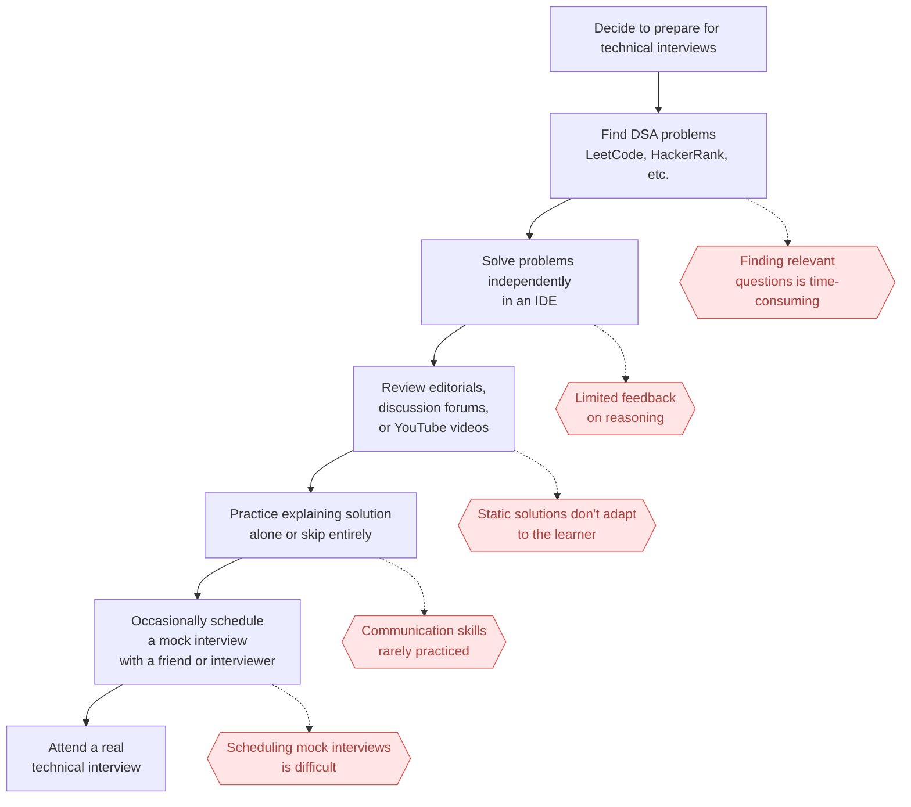
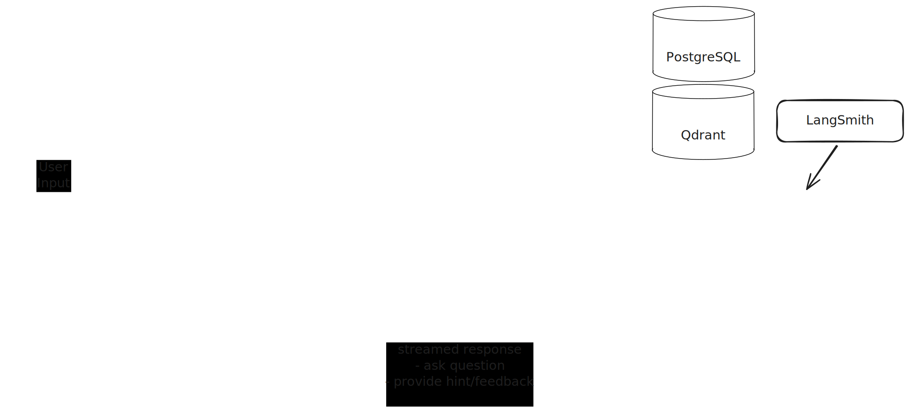

# swell-demo

A demo repo for swell, an AI software engineering coach that helps you practice data structures and algorithms through realistic technical interviews.

## Task 1: Defining Problem, Audience, and Scope

Software engineers struggle to prepare effectively for technical interviews because practicing coding problems alone does not replicate the experience of a real interview.

Software engineers preparing for technical interviews need to develop both strong data structures and algorithms skills and the ability to solve problems under interview conditions. Their goal is not only to arrive at the correct solution, but also to communicate their thought process, respond to hints, justify trade-offs, and collaborate effectively with an interviewer.

Today, most candidates prepare by solving problems on platforms like LeetCode or HackerRank, watching solution videos, or practicing occasionally with friends through mock interviews. While these approaches help build algorithmic knowledge, they provide little opportunity to practice the interactive aspects of a real interview, such as verbalizing reasoning, receiving incremental feedback, handling interviewer prompts, or adapting to changing requirements. As a result, many candidates enter interviews technically prepared but lacking confidence and experience in the collaborative problem-solving process that interviewers actually evaluate.



Questions to evaluate the application:
- Does the AI avoid giving away the solution immediately?
- Does the AI ask follow-up questions after the user proposes an approach?
- Does the AI encourage the user to explain their reasoning before coding?
- Does the AI generate actionable feedback after the interview?

## Task 2: Propose a Solution

swell is an AI-powered software engineering coach that simulates realistic technical interviews to help engineers master data structures and algorithms through pair programming.

### Infrastructure Diagram



Examples of events emitted:

- `CANDIDATE_MESSAGE` (a message submitted by the candidate to the AI Interview Chat panel)
   ```json
   {
     "type": "CANDIDATE_MESSAGE",
     "payload": {
       "text": "I think I can use a hash map to store previously seen values."
     }
   }
   ```

- `CODE_SNAPSHOT` (a snapshot of the code from the Code Editor)
   ```json
   {
     "type": "CODE_SNAPSHOT",
     "payload": {
       "language": "python",
       "code": "def two_sum(nums, target):\n    seen = {}",
       "change_summary": {
         "lines_added": 2,
         "lines_removed": 0
       }
     }
   }
   ```

- `CANDIDATE_IDLE` (the candidate has been idle for `N` time)
   ```json
   {
     "type": "CANDIDATE_IDLE",
     "payload": {
       "duration_seconds": 30,
       "last_activity_type": "CODE_SNAPSHOT"
     }
   }
   ```

### Agent Workflow Diagram


#### Core state model

The core state model of each interview session would look something like:

```json
{
  "session_id": "session-123",
  "problem_id": "two-sum",
  "status": "IN_PROGRESS",
  "current_phase": "APPROACH_DISCUSSION",
  "candidate_status": "PROGRESSING",
  "completed_milestones": [
    "UNDERSTANDS_PROBLEM"
  ],
  "milestones": {
    "UNDERSTANDS_PROBLEM": {
      "status": "COMPLETED",
      "confidence": 0.94,
      "evidence_event_ids": ["evt-10"]
    },
    "CLARIFIES_CONSTRAINTS": {
      "status": "PARTIAL",
      "confidence": 0.61,
      "evidence_event_ids": ["evt-12"]
    },
    "PROPOSES_APPROACH": {
      "status": "IN_PROGRESS",
      "confidence": 0.52,
      "evidence_event_ids": ["evt-15"]
    }
  },
  "hint_level": 0,
  "failed_run_count": 0,
  "last_activity_at": "2026-07-10T14:10:00Z",
  "latest_code_snapshot_id": "snapshot-24",
  "pending_action": null
}
```

#### Event processing flow

When an event arrives:

```
Candidate event
    ↓
Normalize event
    ↓
Apply deterministic rules
    ↓
Ask LLM to interpret ambiguous evidence
    ↓
Update milestones and phase
    ↓
Choose next interviewer action
    ↓
Persist state
```

For example:

```
{
  "type": "CANDIDATE_MESSAGE",
  "payload": {
    "text": "I'll store each number and its index in a hash map."
  }
}
```

The LLM evaluator might return structured output:

```
{
  "observations": [
    {
      "milestone_id": "PROPOSES_HASH_MAP",
      "status": "COMPLETED",
      "confidence": 0.96,
      "evidence": "Candidate explicitly proposed storing values and indices in a hash map."
    }
  ],
  "candidate_status": "PROGRESSING",
  "recommended_action": "ASK_COMPLEXITY_QUESTION"
}
```

The engine validates that output, updates state, and then asks the interviewer model to generate the actual wording:

> “Good. What time and space complexity would that approach have?”

### Deterministic Rules

Some things should not require an LLM.

Examples:

```python
if event.type == "CODE_RUN_COMPLETED" and event.payload["all_tests_passed"]:
    mark_milestone("IMPLEMENTS_CORRECT_SOLUTION", completed=True)

if event.type == "HINT_REQUESTED":
    state.hint_level += 1

if event.type == "CANDIDATE_IDLE":
    if event.payload["duration_seconds"] >= 30:
        state.candidate_status = "POSSIBLY_STUCK"

if state.failed_run_count >= 3:
    state.candidate_status = "DEBUGGING_DIFFICULTY"
```
