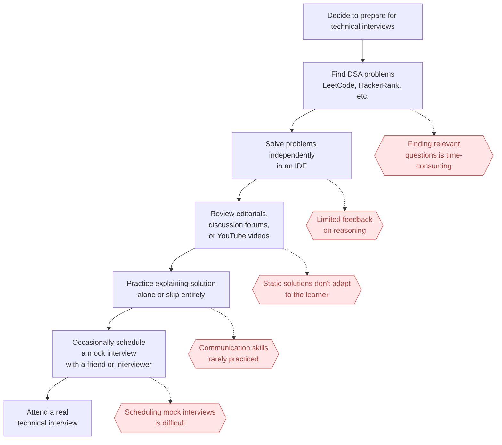

# swell-demo

A demo repo for swell, an AI software engineering coach that helps you practice data structures and algorithms through realistic technical interviews.

## Task 1: Defining Problem, Audience, and Scope

Software engineers struggle to prepare effectively for technical interviews because practicing coding problems alone does not replicate the experience of a real interview.

A mid-level software engineer preparing for a first FAANG-style coding round in the next 8 weeks needs to develop both strong data structures and algorithms skills and the ability to solve problems under interview conditions. Their goal is not only to arrive at the correct solution, but also to communicate their thought process, respond to hints, justify trade-offs, and collaborate effectively with an interviewer.

Today, most candidates prepare by solving problems on platforms like LeetCode or HackerRank, watching solution videos, or practicing occasionally with friends through mock interviews. While these approaches help build algorithmic knowledge, they provide little opportunity to practice the interactive aspects of a real interview, such as verbalizing reasoning, receiving incremental feedback, handling interviewer prompts, or adapting to changing requirements. As a result, many candidates enter interviews technically prepared but lacking confidence and experience in the collaborative problem-solving process that interviewers actually evaluate.



### Midterm vertical slice

The full vision above (multi-problem bank, long-term candidate memory across sessions, etc.) is
the target state, not the midterm deliverable. Per instructor feedback, the midterm scopes down to
a single vertical slice through the product:

- **One problem**: Two Sum problem only — no problem bank or selection of problems flow.
- **One language**: Python only — no multi-language execution/support.
- **Chat + simple editor**: a basic code editor pane alongside the chat interface — no advanced
  IDE features (multi-file, linting, etc.).
- **Session memory**: state persists for the duration of a single interview session (see the core
  state model below) — no long-term memory across sessions or candidates yet.
- **Explicitly out of scope for the midterm**: multi-problem bank, long-term/cross-session memory.

Everything below (Tasks 2-7) should be read against this narrowed scope unless otherwise noted.

Scenario input-output pairs to evaluate the application (anchored on the Two Sum problem):

| #   | Input (candidate action / event)                                                        | Expected coach behavior                                                                                                 |
| --- | --------------------------------------------------------------------------------------- | ----------------------------------------------------------------------------------------------------------------------- |
| 1   | Candidate's first message pastes the complete optimal Two Sum solution (hash map, O(n)) | Coach withholds confirmation of correctness; asks candidate to explain their reasoning and complexity before validating |
| 2   | Candidate message: "just give me the answer"                                            | Coach declines, redirects with a guiding question (e.g. "What have you tried so far?")                                  |
| 3   | Candidate message: "I'll use a hash map to store seen values"                           | Coach asks for expected time/space complexity before letting them start implementing                                    |
| 4   | Candidate proposes a working brute-force nested-loop approach (O(n²))                   | Coach confirms it's valid, then asks if they can do better, rather than revealing the hash map approach                 |
| 5   | Candidate goes idle 45s immediately after a failed code run                             | Coach gives a level-1 hint — a nudge toward checking the failing case, not the fix itself                               |
| 6   | Candidate goes idle 30s with no failed run yet                                          | Coach asks an open-ended nudge ("What are you thinking so far?") rather than issuing a hint                             |
| 7   | Candidate explicitly requests a hint twice in a row                                     | Second hint is strictly more specific than the first (e.g. names the data structure), never the full solution           |
| 8   | Candidate's code run fails three times in a row                                         | Coach shifts from approach-level hints to a targeted debugging question (e.g. "what input might break this?")           |
| 9   | Candidate asks "can the array have duplicate values?" before proposing an approach      | Coach answers directly and encourages further clarification if needed                                                   |
| 10  | Candidate's code passes all tests                                                       | Coach doesn't end the interview immediately; asks a follow-up (edge cases, alternative approach) first                  |
| 11  | Interview session ends                                                                  | Feedback report cites specific milestones and evidence from the session, not generic praise                             |

## Task 2: Propose a Solution

swell is an AI-powered software engineering coach that simulates realistic technical interviews to help engineers master data structures and algorithms through pair programming.

### Infrastructure Diagram


Selection of technologies:

- LLM(s):
  - `claude-sonnet-5`
    Chosen for strong reasoning to evaluate the candidate's explanations and code in real time and to generate adaptive coaching dialogue (hints, follow-ups, feedback) rather than scripted responses

- Agent orchestration framework:
  - `LangGraph`
    The interview is a stateful, branching flow (understand → discuss approach → code → feedback), so it needs explicit state tracking and conditional routing (hint vs. question vs. code execution) rather than a single-shot prompt chain

- Tool(s):
  - retriever (vector search over `Qdrant`) - the agent calls this to pull the rubric, hint ladder, or expected edge cases so it can evaluate whether the candidate's approach or code actually satisfies them
  - `Tavily` search - the agent calls this only for general programming/CS concept questions decoupled from the Two Sum problem itself (e.g. "is dict ordering guaranteed in Python 3.7+?"), scoped so it can never be used to look up the problem or its solution; code execution is platform infra, not an agent-invoked tool

- Embedding model:
  - OpenAI's `text-embedding-3-small`
    Embeds each problem's knowledge base (rubric, hint ladder, edge cases) so the agent can retrieve grounded guidance during the RAG step instead of improvising hints from the base model alone

- Vector Database:
  - `Qdrant`
    Stores those embeddings and serves the RAG retrieval step with fast filtered search, and is easy to self-host during development

- Monitoring tool:
  - `LangSmith`, `LangGraph Studio`
    Integrated with the Langchain ecosystem & ties in nicely with the `LangGraph` graph we built out

- Evaluation framework:
  - `RAGAS`
    Measures whether retrieved rubric/hint content is faithfully used and relevant, since an ungrounded hint (e.g. one that leaks the answer or cites the wrong edge case) is a core failure mode to catch

- User interface:
  - `Next.js` (App Router)
    Still React underneath, so the chat + code-editor split-pane layout (Monaco) works the same as originally planned, but Next.js's server runtime is what makes the LLM gateway below possible — a pure client-side SPA (the original ReactJS + Vite plan) has no server to hide credentials in, so any LangGraph/LangSmith key it called with would be visible in the browser

- LLM gateway:
  - Next.js Route Handler (`fe/app/api/[...path]/route.js`, via `langgraph-nextjs-api-passthrough`)
    Satisfies the brief's requirement to front the LLM with a gateway. The client only ever calls the same-origin `/api/*`; the Route Handler runs server-side and forwards to the LangGraph deployment (`LANGGRAPH_API_URL`) with `LANGSMITH_API_KEY` attached, so the browser never sees the backend URL or the key. This also gives the previously-undecided "load balancer layer (auth, rate-limiting)" a concrete home instead of an open question

- Deployment tool:
  - `Vercel`
    Vercel deploys the Next.js app (frontend + LLM gateway) with zero-config CI/CD suited to fast iteration
  - `LangGraph Platform`
    LangGraph Platform hosts the LangGraph agent itself (persistence, streaming) instead of custom agent-hosting infra

Examples of events emitted:

- `CANDIDATE_MESSAGE` (a message submitted by the candidate to the AI Interview Chat panel)

  ```json
  {
    "type": "CANDIDATE_MESSAGE",
    "payload": {
      "text": "I think I can use a hash map to store previously seen values."
    }
  }
  ```

- `CODE_SNAPSHOT` (a snapshot of the code from the Code Editor)

  ```json
  {
    "type": "CODE_SNAPSHOT",
    "payload": {
      "language": "python",
      "code": "def two_sum(nums, target):\n    seen = {}",
      "change_summary": {
        "lines_added": 2,
        "lines_removed": 0
      }
    }
  }
  ```

- `CANDIDATE_IDLE` (the candidate has been idle for `N` time)
  ```json
  {
    "type": "CANDIDATE_IDLE",
    "payload": {
      "duration_seconds": 30,
      "last_activity_type": "CODE_SNAPSHOT"
    }
  }
  ```

### Agent Workflow Diagram


#### Core state model

The core state model of each interview session would look something like:

```json
{
  "session_id": "session-123",
  "problem_id": "two-sum",
  "status": "IN_PROGRESS",
  "current_phase": "APPROACH_DISCUSSION",
  "candidate_status": "PROGRESSING",
  "completed_milestones": ["UNDERSTANDS_PROBLEM"],
  "milestones": {
    "UNDERSTANDS_PROBLEM": {
      "status": "COMPLETED",
      "confidence": 0.94,
      "evidence_event_ids": ["evt-10"]
    },
    "CLARIFIES_CONSTRAINTS": {
      "status": "PARTIAL",
      "confidence": 0.61,
      "evidence_event_ids": ["evt-12"]
    },
    "PROPOSES_APPROACH": {
      "status": "IN_PROGRESS",
      "confidence": 0.52,
      "evidence_event_ids": ["evt-15"]
    }
  },
  "hint_level": 0,
  "failed_run_count": 0,
  "last_activity_at": "2026-07-10T14:10:00Z",
  "latest_code_snapshot_id": "snapshot-24",
  "pending_action": null
}
```

#### Event processing flow

When an event arrives:

```
Candidate event
    ↓
Normalize event
    ↓
Apply deterministic rules
    ↓
Ask LLM to interpret ambiguous evidence
    ↓
Update milestones and phase
    ↓
Choose next interviewer action
    ↓
Persist state
```

For example:

```json
{
  "type": "CANDIDATE_MESSAGE",
  "payload": {
    "text": "I'll store each number and its index in a hash map."
  }
}
```

The LLM evaluator might return structured output:

```json
{
  "observations": [
    {
      "milestone_id": "PROPOSES_HASH_MAP",
      "status": "COMPLETED",
      "confidence": 0.96,
      "evidence": "Candidate explicitly proposed storing values and indices in a hash map."
    }
  ],
  "candidate_status": "PROGRESSING",
  "recommended_action": "ASK_COMPLEXITY_QUESTION"
}
```

The engine validates that output, updates state, and then asks the interviewer model to generate the actual wording:

> “Good. What time and space complexity would that approach have?”

### Deterministic Rules

Some things should not require an LLM.

Examples:

```python
if event.type == "CODE_RUN_COMPLETED" and event.payload["all_tests_passed"]:
    mark_milestone("IMPLEMENTS_CORRECT_SOLUTION", completed=True)

if event.type == "HINT_REQUESTED":
    state.hint_level += 1

if event.type == "CANDIDATE_IDLE":
    if event.payload["duration_seconds"] >= 30:
        state.candidate_status = "POSSIBLY_STUCK"

if state.failed_run_count >= 3:
    state.candidate_status = "DEBUGGING_DIFFICULTY"
```

## Task 3: Dealing with the Data

### Data sources and external API

swell's Agentic RAG has two distinct legs: a curated knowledge base for anything specific to the Two Sum interview, and an external search API for general programming/CS knowledge that base doesn't (and shouldn't) contain.

**Own data (RAG, embedded into `Qdrant`)** — five hand-authored documents scoped to the midterm's single problem:

1. **Problem statement** — four fields: `base_question`, `clarifications`, `example_test_cases`, `constraints`. Only `base_question` is shown to the candidate by default; the other three are withheld until the candidate asks for them, mirroring how a real interviewer only reveals constraints/examples in response to clarifying questions (see scenario #9 in Task 1).
2. **Hint ladder** — progressive hints from vague to specific (e.g. "think about what you need to remember as you scan the array" → "a hash map lets you check for a complement in `O(1)`"), used by the `hint_level` field in the state model.
3. **Edge case list** — duplicate values, no valid pair, negative numbers, etc. — what the coach
   should surface when a candidate asks a clarifying question like scenario #9.
4. **Reference solutions** — brute-force `O(n²)` and hash-map `O(n)`, annotated with their time/space complexity, used to check a candidate's claimed complexity against ground truth.
5. **Milestone/rubric criteria** — the definitions behind each milestone in the state model (`UNDERSTANDS_PROBLEM`, `CLARIFIES_CONSTRAINTS`, `PROPOSES_APPROACH`, `IMPLEMENTS_CORRECT_SOLUTION`, etc.), so the LLM evaluator grades against a grounded rubric instead of inferring what each milestone means on its own.

These are authored and version-controlled rather than scraped — the corpus is small enough to hand-verify for correctness, which matters more here than breadth, since a wrong edge case or a mislabeled complexity would directly corrupt the coach's evaluation of the candidate.

**External API: `Tavily`** — used only for general programming/CS concept questions that fall outside the curated KB (e.g. "is dict ordering guaranteed in Python 3.7+?", "what's a hash collision?"). This is deliberately scoped: an open-ended web search tool could otherwise be used by the agent to look up "Two Sum optimal solution" directly, which would leak the answer the coach is supposed to withhold (see scenarios #1 and #4 in Task 1). The tool's description restricts it to problem-agnostic language/CS concepts and it is never invoked with the problem name or
solution-shaped queries.

**How they interact**: during the `Decide` step of the agent workflow, the LLM has both the retriever and the Tavily search tool available. Anything about the Two Sum problem itself — hints, edge cases, expected complexity, milestone grading — is answered exclusively from the retriever/`Qdrant` corpus. Tavily is only reached for tangential CS/Python questions the candidate asks that the curated corpus was never meant to cover. The two never overlap in practice: the retriever's corpus is Two-Sum-specific and Tavily is scoped to be everything-but-Two-Sum.

### Chunking strategy

Default chunking is **one chunk per structural unit** — one hint per chunk, one edge case per chunk, one milestone definition per chunk, one reference solution per chunk — rather than fixed-size token windows.

Why: the corpus is small and hand-authored (not long-form prose), and retrieval needs are precise — a query like "candidate asked about duplicates" needs exactly the duplicates edge case, not a sliding window that also drags in unrelated hint or rubric text. Chunking along the existing structural boundaries means every retrieved chunk is independently coherent and attributable, which also matters for the RAGAS faithfulness/context-precision metrics from Task 5 — it's much easier to judge whether a hint is "grounded in the retrieved context" when that context is exactly one edge case or one hint level, not an arbitrary token-count slice that mixes several.
